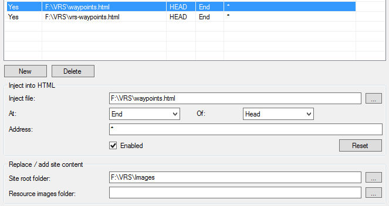

# VRS Waypoints
Support for RNAV waypoints in Virtual Radar Server.

## Setup
  * Install the [Custom Content Plugin](http://www.virtualradarserver.co.uk/Documentation/CustomContent/Default.aspx)
  * Set "Site root folder" to "Images" folder
  * Inject "waypoints.html" and "vrs-waypoints.html" to all addresses at End of HEAD

  
